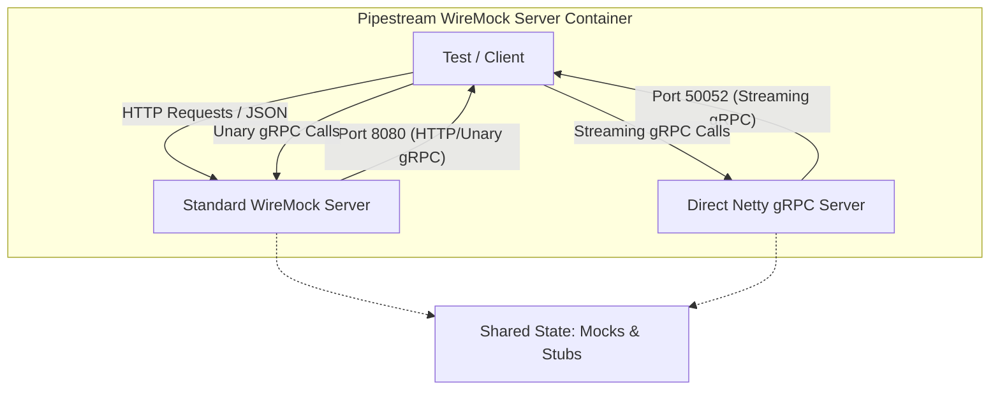

# Pipestream WireMock Server

A specialized mock server designed for testing the **Pipestream AI** platform. It combines a standard WireMock instance with a custom Netty-based gRPC server to handle complex, streaming scenarios that are difficult to mock with standard tools.

This project is distributed as a Docker container and is critical for integration testing of gRPC clients.

## CI/CD & artifacts

| Artifact | Registry | Image / Dependency |
| :--- | :--- | :--- |
| **Docker Image** | GitHub Container Registry (GHCR) | `ghcr.io/ai-pipestream/pipestream-wiremock-server:latest` |
| **JAR** | Maven Central | `ai.pipestream:pipestream-wiremock-server` |

## Architecture

This application runs two servers simultaneously:



1.  **Standard WireMock Server (Port 8080)**
    *   **Purpose**: Handles standard HTTP mocks and simple unary gRPC calls.
    *   **Technology**: WireMock 3.x + `wiremock-grpc-extension`.
    *   **Use Case**: Mocking simple responses where request matching is straightforward.

2.  **Direct gRPC Server (Port 50052)**
    *   **Purpose**: Handles complex **server-side streaming** scenarios.
    *   **Technology**: Native Netty gRPC Server.
    *   **Use Case**: Simulating long-running processes like the "Service Registration Lifecycle" where the server needs to emit multiple events over time (e.g., `STARTED` -> `VALIDATED` -> `COMPLETED`).

## Usage

### Running via Docker (Recommended)

```bash
docker run -p 8080:8080 -p 50052:50052 ghcr.io/ai-pipestream/pipestream-wiremock-server:latest
```

### Running Locally

```bash
./gradlew run
```

## Mocked Services

### Platform Registration Service (Port 50052)

The Direct gRPC Server implements the `PlatformRegistrationService` to test the platform's ability to handle streaming registration events.

| Method | Behavior |
| :--- | :--- |
| `registerService` | Emits a sequence of 6 events (`STARTED` to `COMPLETED`) with artificial delays to simulate a real registration process. |
| `registerModule` | Emits a sequence of 10 events (including schema validation and Apicurio registration phases). |
| `listServices` | Returns a static list of 2 mock services (`repository-service`, `account-manager`). |
| `listModules` | Returns a static list of 2 mock modules (`parser`, `chunker`). |

## Configuration

*   **WireMock Port**: Default `8080`. Can be overridden by passing the port as the first command-line argument.
*   **Streaming Port**: Fixed at `50052`.

## Development

*   **Build**: `./gradlew build`
*   **Docker Build (Local)**: `./gradlew jibDockerBuild`
*   **Release**: Versioning is handled via `axion-release` plugin. Tags created in Git trigger CI builds.
