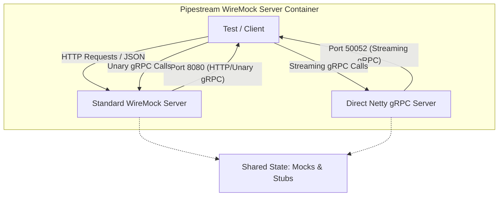

# Pipestream WireMock Server

A specialized mock server designed for testing the **Pipestream AI** platform. It combines a standard WireMock instance with a custom Netty-based gRPC server to handle complex, streaming scenarios that are difficult to mock with standard tools.

This project is distributed as a Docker container and is critical for integration testing of gRPC clients.

## CI/CD & artifacts

| Artifact | Registry | Image / Dependency |
| :--- | :--- | :--- |
| **Docker Image** | GitHub Container Registry (GHCR) | `ghcr.io/ai-pipestream/pipestream-wiremock-server:latest` |
| **JAR** | Maven Central | `ai.pipestream:pipestream-wiremock-server` |

## Architecture

This application runs two servers simultaneously:



1.  **Standard WireMock Server (Port 8080)**
    *   **Purpose**: Handles standard HTTP mocks and simple unary gRPC calls.
    *   **Technology**: WireMock 3.x + `wiremock-grpc-extension`.
    *   **Use Case**: Mocking simple responses where request matching is straightforward.

2.  **Direct gRPC Server (Port 50052)**
    *   **Purpose**: Handles complex **server-side streaming** scenarios.
    *   **Technology**: Native Netty gRPC Server.
    *   **Use Case**: Simulating long-running processes like the "Service Registration Lifecycle" where the server needs to emit multiple events over time (e.g., `STARTED` -> `VALIDATED` -> `COMPLETED`).

## Usage

### Running via Docker (Recommended)

```bash
docker run -p 8080:8080 -p 50052:50052 ghcr.io/ai-pipestream/pipestream-wiremock-server:latest
```

### Running Locally

```bash
./gradlew run
```

## Mocked Services

This server provides comprehensive mocking capabilities for the Pipestream platform, supporting isolated integration testing.

### Platform Registration Service (Port 50052)

The Direct gRPC Server implements the `PlatformRegistrationService` to test the platform's ability to handle streaming registration events.

| Method | Behavior |
| :--- | :--- |
| `registerService` | Emits a sequence of 6 events (`STARTED` to `COMPLETED`) with artificial delays to simulate a real registration process. |
| `registerModule` | Emits a sequence of 10 events (including schema validation and Apicurio registration phases). |
| `listServices` | Returns a static list of 2 mock services (`repository-service`, `account-manager`). |
| `listModules` | Returns a static list of 2 mock modules (`parser`, `chunker`). |

### PipeDoc Service Mock (Repository Service)

**Class:** `ai.pipestream.wiremock.client.PipeDocServiceMock`

Provides complete mocking for document storage and retrieval operations, supporting the Kafka Sidecar and Engine integration testing.

**Features:**
- **Document Operations**: `savePipeDoc`, `getPipeDoc` (GetPipeDocByReference)
- **Blob Operations**: Binary data retrieval with `GetBlob`
- **Error Scenarios**: NOT_FOUND, UNAVAILABLE, INTERNAL, RESOURCE_EXHAUSTED, ALREADY_EXISTS
- **Configurable Behavior**: Latencies, failures, and custom responses

**Example Usage:**
```java
PipeDocServiceMock mock = new PipeDocServiceMock(wireMock);

// Register a document
PipeDoc doc = PipeDoc.newBuilder().setDocId("doc-123").build();
mock.registerPipeDoc("doc-123", "account-456", doc);

// Register a blob
FileStorageReference blobRef = FileStorageReference.newBuilder()
    .setDriveName("default")
    .setObjectKey("blob-uuid.bin")
    .build();
mock.registerBlob(blobRef, ByteString.copyFromUtf8("content"));

// Mock error scenarios
mock.mockSavePipeDocUnavailable(); // For retry testing
mock.mockGetBlobNotFound(blobRef); // For missing blob scenarios
```

### Module Service Mock (PipeStepProcessor)

**Classes:** 
- `ai.pipestream.wiremock.client.PipeStepProcessorMock` - Core module processing mock
- `ai.pipestream.wiremock.client.MockModuleRegistry` - High-level configuration API

Generic module service supporting all module types (parser, chunker, embedder, sink) with configurable success/failure scenarios.

**Features:**
- **Module Types**: Parser, Chunker, Embedder, Sink
- **Capability Management**: Dynamic module capabilities via gRPC metadata headers
- **Processing Scenarios**: Success, failure, blob not hydrated, unavailable
- **Pre-configured Flows**: Parser flow, direct flow, error scenarios, large file testing

**Example Usage:**
```java
MockModuleRegistry registry = new MockModuleRegistry(wireMock);

// Register modules using fluent API
registry.registerParserModule("tika-parser")
    .version("1.0.0")
    .host("localhost", 50053)
    .supportedMimeTypes("application/pdf", "text/plain")
    .build();

registry.registerChunkerModule("text-chunker")
    .chunkSize(512)
    .overlap(50)
    .build();

// Or use pre-configured scenarios
registry.setupParserFlowScenario(); // Complete parser pipeline
registry.setupDirectFlowScenario(); // No-parser pipeline
registry.setupErrorScenarios(); // Error handling testing

// Configure module behavior
registry.setActiveModule("tika-parser");
registry.getProcessorMock().mockProcessDataSuccess();
registry.getProcessorMock().mockProcessDataFailure("Error", "CODE");
```

### Additional Mocks

- **FilesystemServiceMock**: Mock blob storage with configurable test blobs
- **AccountManagerMock**: User account and authentication mocking
- **DataSourceAdminMock**: Data source configuration mocking
- **EngineV1ServiceMock**: Engine service operations
- **ServiceMockRegistry**: Auto-discovery and initialization of all mocks via ServiceLoader

## Configuration

*   **WireMock Port**: Default `8080`. Can be overridden by passing the port as the first command-line argument.
*   **Streaming Port**: Fixed at `50052`.

## Development

*   **Build**: `./gradlew build`
*   **Docker Build (Local)**: `./gradlew jibDockerBuild`
*   **Release**: Versioning is handled via `axion-release` plugin. Tags created in Git trigger CI builds.
